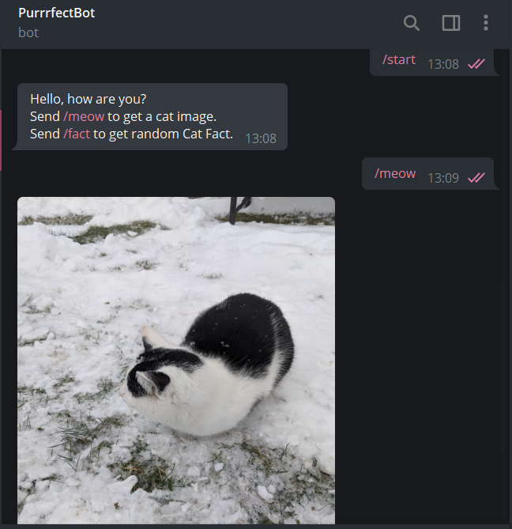

# CATBOT 

## Description
A Purrfect 😺 Telegram bot to send you cat images and facts. I used [pytelegrambotapi](https://github.com/eternnoir/pyTelegramBotAPI) for this project along with 2 API.
- [Cat images](https://github.com/ThatCopy/catAPI/wiki/Usage)
- [Cat Facts](https://alexwohlbruck.github.io/cat-facts/)

## Techstack
- Python

## Acknowledgment
- [CS Dojo](https://youtu.be/NwBWW8cNCP4)
- [Dzaky Widya Putra](https://www.freecodecamp.org/news/learn-to-build-your-first-bot-in-telegram-with-python-4c99526765e4/)